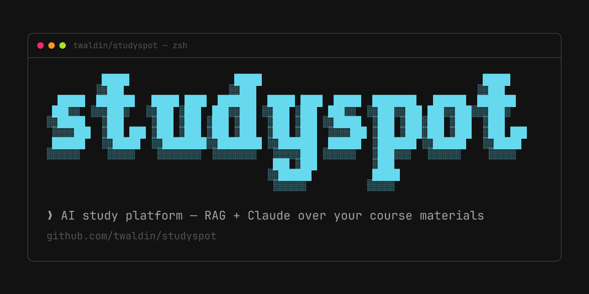

# studyspot



A study assistant that answers questions about your actual course materials,
not the whole internet. Students in a course upload their syllabi, slides, and
notes into a shared course knowledge base; the assistant answers from those
documents with citations, and can turn them into flashcards and quizzes.

> **status:** this is the original studyspot implementation, which I co-founded
> and built in 2025 — frozen as of when I moved on to agent tooling. The
> [studyspot.us](https://studyspot.us) that's live today is a separate rewrite
> by my co-founder; this repo is not what's deployed there.

## what it is

Generic chatbots don't know what's on your midterm. studyspot fixes that by
scoping the assistant to one course at a time and giving it retrieval tools
for documents that course's students actually uploaded.

- **Course knowledge bases.** Join a school and a course, upload materials
  (PDF, DOC/DOCX and plain text), and they become a shared, searchable corpus
  for everyone in that course.
- **Course-grounded answers (RAG).** The agent can search the course's document
  chunks, pull relevant passages and provide source attribution. Retrieval is
  agent-chosen, not a mandatory step on every question.
- **Study tools from your own material.** Generate flashcard sets and quizzes
  off the uploaded documents, then save, edit, and share them by link.
- **Canvas import.** Connect a Canvas LMS account to pull course content in
  instead of uploading everything by hand.
- **Chats that persist.** Conversations are saved, forkable, and shareable via
  public share links. Streaming supports best-effort navigation and reconnects.

## how it works

Three moving parts, in a pnpm monorepo:

```
apps/web            Next.js 15 app — auth, course/chat UI, upload, API routes
workers/assistant   Mastra AI worker — RAG pipeline, streaming, study-tool gen
Supabase            Postgres + pgvector — documents, chunks, chats, embeddings
```

1. **Ingestion.** The assistant parses non-duplicate uploads with LlamaParse,
   chunks them, embeds with OpenAI `text-embedding-3-small` (1536-dim), and
   stores chunks linked through a document to its course. The web app also uses
   pdf2json for syllabus/course extraction.
2. **Retrieval + answer.** The [Mastra](https://mastra.ai) agent chooses whether
   to call semantic search or full-document tools. Semantic search embeds the
   query and calls `match_documents_by_course`; `set_sources` supplies citations.
   Course verification is a separate worker endpoint.
3. **Streaming.** SSE events are buffered for catch-up by reconnecting or second
   clients. Buffers live in one Worker isolate, not durable/shared storage;
   continuation after disconnect or restart is not guaranteed. The manager
   attempts a final conversation database update when a response completes.

The assistant runs as a standalone worker. Server-side ingestion and suggested
queries can use a service binding with an HTTP fallback; browser chat uses the
configured public assistant URL directly.

## stack

- **Web:** Next.js 15 (App Router), React, TypeScript, TailwindCSS 4, Radix UI,
  TanStack Query
- **AI:** Mastra agent framework; Anthropic Claude for chat (pinned in
  `workers/assistant/src/mastra/agents/studyspot-agent.ts`), OpenAI for embeddings,
  Google Gemini helpers in the web app. Worker prompt defaults are inline in
  `workers/assistant/src/services/config-loader.service.ts`; the JSON files in
  `config/prompt-configs/` are retained references, not runtime-loaded config
- **Data:** Supabase (Postgres + pgvector), Clerk-JWT clients and service-role
  paths. Deployed RLS policies are not committed here
- **Uploads:** UploadThing declares file-type/size limits; additional validation
  helpers exist, but the upload handler logs and swallows their failures
- **Shared UI:** `@studyspot/ui` — a Radix + Tailwind component library used by
  the web app; the landing page has its own components

## repo layout

```
apps/web            main application
apps/landing-page   marketing site
workers/assistant   Mastra assistant worker (RAG, streaming, tools)
packages/ui         shared component library
config/             prompt configs + eval queries for the assistant
```

## running locally

Needs a configured development Supabase project (with pgvector), Anthropic and
OpenAI API keys, plus Clerk and UploadThing configuration for the full app.
Assistant document ingestion also needs LlamaParse; web Gemini helpers use
Google/Gemini credentials. See [CLAUDE.md](CLAUDE.md#configuration-management--secrets) for
source-referenced variable names. App workflows can contact external services.

Inspect `workers/assistant/build.sh` before use: it temporarily renames worker
env files and copies selected root `.env` values into generated
`.mastra/output/.dev.vars`. It does not fully isolate inherited environment
variables. Keep generated credentials out of Git.

```bash
pnpm install
pnpm build:assistant  # generates .mastra/output required by root dev:assistant
pnpm dev        # web app (:3000) + assistant worker (:8787), concurrently
```

Individual pieces:

```bash
pnpm dev:web         # Next.js app only
pnpm dev:assistant   # assistant worker only
pnpm dev:landing     # Wrangler; needs an OpenNext build (see landing README)
```

Root assistant development serves generated output; rebuild after assistant
source changes. For Mastra's development server/playground instead, run
`pnpm dev` inside `workers/assistant`. Landing build/dev details are in
[apps/landing-page/README.md](apps/landing-page/README.md).

## deploy

The committed configuration targets Cloudflare Workers for the web app,
assistant and landing page. Root `pnpm build` builds only web + assistant;
the landing page needs its own `pnpm build:cloudflare` in `apps/landing-page`.
Root `pnpm deploy` deploys all three existing builds without building first,
using OpenNext for web/landing and Wrangler for the assistant.

These are historical source configurations, not verified live deployments.
The rewrite serving studyspot.us today uses a different stack — see status above.
